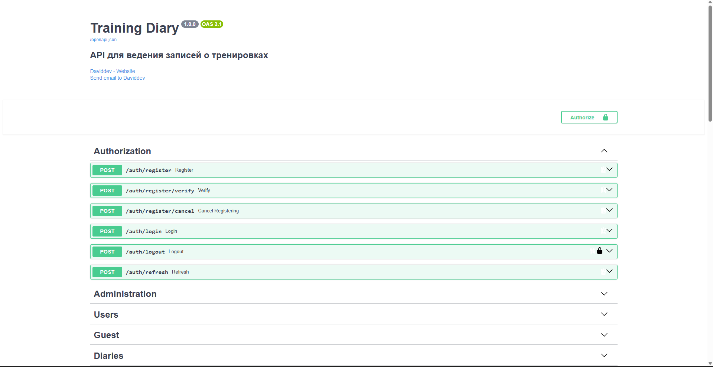
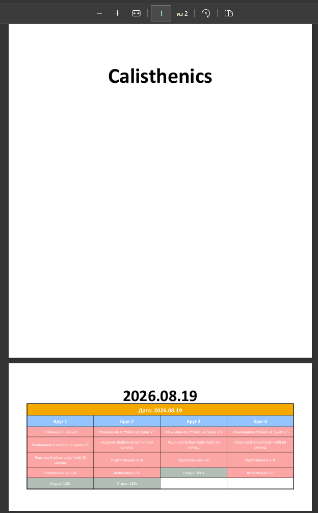
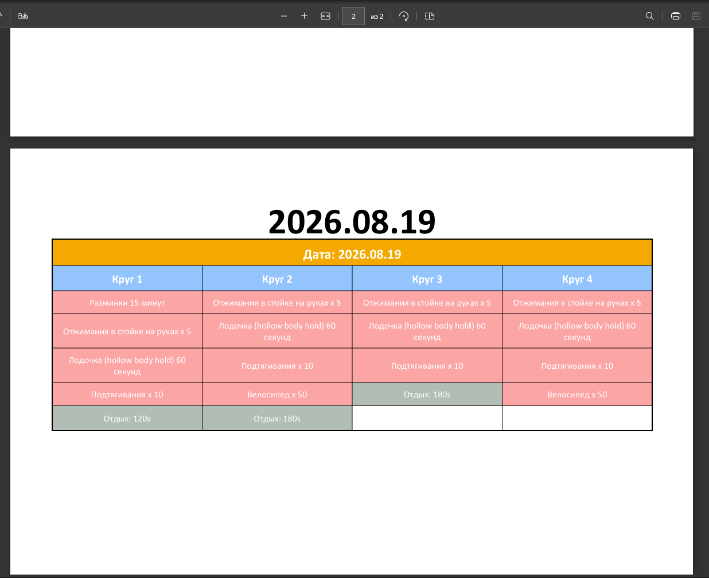
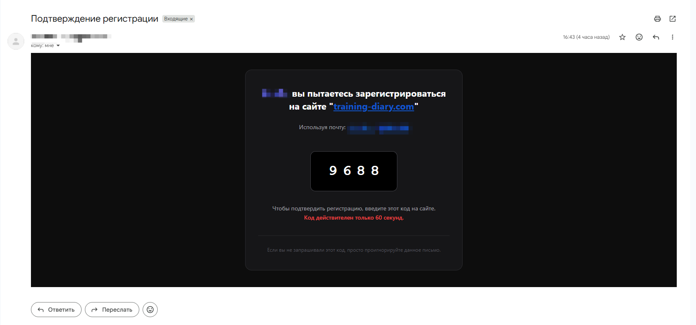
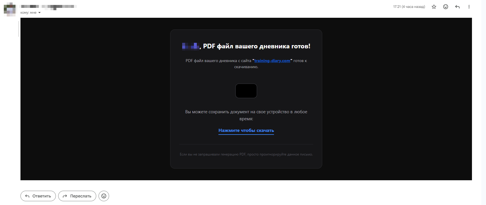

# Training Diary API 📝 🤸‍♂️|🏋️‍♂️

REST API для ведения подробного дневника на FastAPI с PostgreSQL и Redis.

## Стек технологий

- python 3.13
- FastAPI
- PostgreSQL
- Redis
- SQLAlchemy 2.0 (async)
- Celery
- Alembic
- Pydantic v2
- JWT аутентификация
- SMTP
- Генерация PDF

## Структура проекта

```
app/
├── main.py             # Точка входа
├── models.py           # SQLAlchemy модели
├── parsers.py          # Парсеры
├── handlers.py         # Глобальные хэндлеры
├── exceptions.py       # Кастомные исключения
├── middlewares.py      # Мидлвейры  
├── repositories/       # Репозитории для работы с БД и кэшем
├── services/           # Сервисы для работы с репозиториями
├── workers/            # Воркеры Celery
├── schemes/            # Pydantic схемы
├── fonts/              # Шрифты для pdf worker
├── core/               # Настройки приложения
└── api/
    ├── dependencies.py # Зависимости
    └── routers/
        ├── admin.py    # Админка
        ├── auth.py     # Аутентификация
        ├── diary.py    # Пользовательские дневники
        ├── exercise.py # Упражнения
        ├── guest.py    # Гости
        ├── language.py # Управление языком API
        ├── pdf.py      # Работа с PDF
        ├── user.py     # Пользователь
        └── weight.py   # Пользовательские веса
```

## Быстрый старт

### С Docker (рекомендуется)

```bash
# Клонировать репозиторий
git clone https://github.com/daviddev09/Training-Diary-API.git
cd Training-Diary-API

# Создать .env файл
cp .env.example .env

# Запустить контейнеры
docker compose up --build
```

API будет доступен по адресу http://localhost:8000

Swagger UI: http://localhost:8000/docs

### Локально (без Docker)

```bash
# Создать виртуальное окружение
python -m venv venv
source venv/bin/activate  # Linux/Mac
venv\Scripts\activate     # Windows

# Установить зависимости
pip install -r requirements.txt

# Настроить переменные окружения
cp .env.example .env
# Отредактировать .env указав DATABASE_URL для локальной PostgreSQL
# Запустить в контейнере Redis и отредактировать .env указав REDIS_HOST

# Применить миграции
alembic upgrade head

# Запустить сервер
uvicorn app.main:app --reload
```

## Основные эндпоинты API

### Аутентификация

| Метод | Endpoint | Описание | Доступ |
|-------|----------|----------|--------|
| POST | /auth/register | Сохранение данных в кэше и отправка кода подтврждения email | Все |
| POST | /auth/register/verify | Подтверждение регистрации и сохранение данных в БД | Все |
| POST | /auth/login | Вход по username или email (получение JWT access и refresh токенов) | Все |
| POST | /auth/logout | Выход из системы | Авторизованные |
| POST | /auth/refresh | Обновление JWT токенов | Все |

### Администрация

| Метод | Endpoint | Описание | Доступ |
|-------|----------|----------|--------|
| PATCH | /admin/grant | Выдача прав администратора | Owner |
| PATCH | /admin/revoke | Лишение прав администратора | Owner |
| DELETE | /admin/user | Удаление пользователя | Admin и Owner |

### Гость

| Метод | Endpoint | Описание | Доступ |
|-------|----------|----------|--------|
| POST | /guest/diary | Создание гостя и его дневника | Все |
| GET | /guest/diary | Получение дневника гостя | Гость |
| DELETE | /guest/diary | Удаление гостя и его дневника | Гость |

### Пользователь

| Метод | Endpoint | Описание | Доступ |
|-------|----------|----------|--------|
| GET | /users | Получить свой профиль | Авторизованные |
| PATCH | /users | Обновление профиля | Авторизованные |
| DELETE | /users | Удаление профиля | Авторизованные |

### Язык

| Метод | Endpoint | Описание |
|-------|----------|----------|
| PATCH | /language/set | Смена языка ответа сервера |
| GET | language/translations | Получение переводов для фронтенда |

## Тестирование

```bash
# Установить зависимости для тестов
pip install -r requirements.txt

# Запустить тесты
pytest
```

## Миграции

```bash
# Создать новую миграцию
alembic revision --autogenerate -m "description"

# Применить миграции
alembic upgrade head

# Откатить последнюю миграцию
alembic downgrade -1
```

## Переменные окружения

| Переменная | Описание | По умолчанию |
|------------|----------|--------------|
| DATABASE_URL | URL подключения к PostgreSQL | postgresql+asyncpg://postgres:postgres@db:5432/training_diary |
| JWT_SECRET_KEY | Секретный ключ для JWT | dev-secret-change-me |
| REDIS_HOST | Host Redis контейнера |
| REDIS_PORT | Port Redis контейнера | 6379 |
| SMTP_EMAIL | Адрес почты для отправки писем по SMTP | smtp-email-address |
| SMTP_APP_PASSWORD | Пароль приложения для отправки писем по SMTP | smtp-app-passowrd |
| OWNER_EMAIL | Почта пользователя с ролью Owner | owner@gmail.com |
| OWNER_USERNAME | Имя пользователя, пользователя с ролью Owner | @owner |
| OWNER_NAME | Имя пользователя с ролью Owner | Owner |
| OWNER_AGE | Возраст пользователя с ролью Onwer | 18 |
| OWNER_PASSWORD | Пароль пользователя с ролью Onwer | ******** |

## Скриншоты приложения

### Swagger UI



### Примеры генерируемого PDF файла

| Титульная страница генеруемого PDF | Вторая (и третье и другие) страница генерируемого PDF |
|------------------------------------|-----------------------------------------------|
| <p>  </p> | <p>  </p> |

### Примеры сообщений отправляемых в почту

#### Подтверждение регистриции

---

<p>  </p>

#### Оповещение о сгенерированном PDF и ссылка для скачивания

---

<p>  </p>